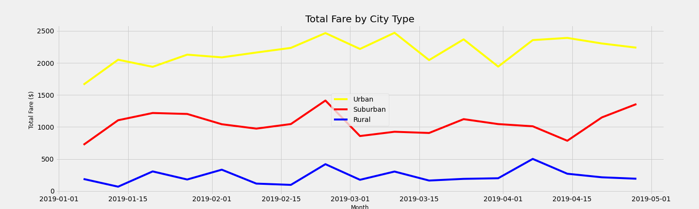

# PyBer Rideshare: An Analysis of Ridesharing Data Concerning Areas of Varying Population Density

## Overview and Background

The primary objective of the project is to analyze PyBer ridesharing data for underlying trends and actionable insights to allow the Company to better provide improved access to underserved geographies. 

The data consists of two sets describing city-level data and another set with ride-level data with both being provided via csv. Both sets are complete with no omitted values and contain sufficient observations to allow for the application of statistical inference. The city-level set describes the number of drivers per city in 120 cities where the company operates. Each city is also categorized as either urban, rural, or suburban. These categorical distinctions will be a central focus point of this analysis.  The ride-level set describes the fares, date, and city for over 2,300 rides conduction in the first and second quarter of 2019. 

The python pandas and matplotlib libraries were used to analyze the data. With the pandas library, we were able to read the data provided via csv and consolidate the two sets into a single data frame. Data figures Total Rides, Total Drivers, Average Fare per Ride, and Average Fare per Driver were calculated for each subset and consolidated into a single data frame for presentation in this analysis. The merged data frame was then visualized using tools in the matplotlib library plotting total fares for each subset across the analysis period using a line plot. Visualization was able to be achieved by grouping the data by subset (Urban, Rural, Suburban) and by date.  The data was then added to a new pivot table data frame using the pivot function and resetting the index to be the date. Individual ride dates were then aggregated into weekly buckets for ease of presentation. 

## Findings for Rural, Suburban, and Urban Areas

### Rural
Rural rides constitute the least served segment for the Company comprising 5% of total rides and thus consistently ranking lowest in total fares across the analysis period. However, though 5% of rides took place in rural areas, only 2.5% of drivers in the set serve these rural areas. Though total fares collected are low, fare-per-ride and fare-per-driver figures for the rural subset are significantly higher than the other two subsets. Routes in rural areas are likely longer than in urban or suburban areas resulting in the highest fare per ride figure in the analysis. 

### Suburban
Suburban data comprises roughly 26% of the rider and 16% of drivers in the data. In both figures above, suburban ridesharing data tends to be somewhere between the rural and urban subsets consistently. 

### Urban
Urban data comprises approximately 68% and 81% of rides and drivers, respectively. Its total fares collected are also significantly higher than either the rural or the suburban subsets. AS is evident in the data frame summary above, we see the opposite of the phenomenon witnessed with rural data. Its relative intensity of drivers to the number of rides causes average fare-per-ride to be lower than fare-per-driver. An excess in the supply of drivers in urban areas causes each driver in that area to receive half to 2.5 times less for each fare.  Also conversely to the rural data, urban route lengths are likely shortest, causing average fare per ride to be lowest among the subsets. 

## Summary
### Given the Analysis above, we have the following recommendations toward optimizing service in underserved areas:

  - Optimize route length to increase the ability of each driver to handle an increased number of rides in all three areas.
  - Increase incentives for urban and, albeit to a less extent, suburban drivers to drive in rural areas. 
  - Increase advertising and offer customer rebates to increase usage in rural areas. 
  
